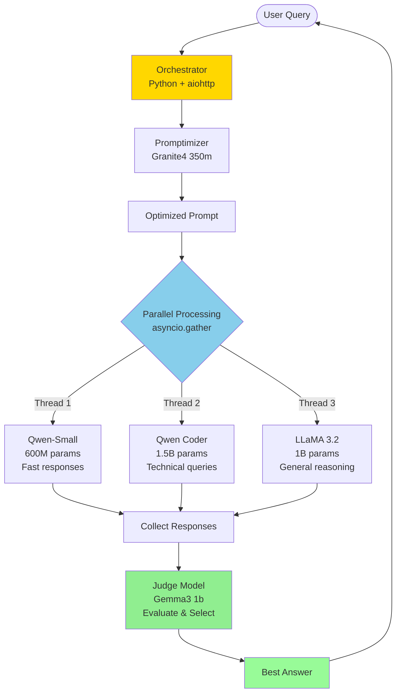
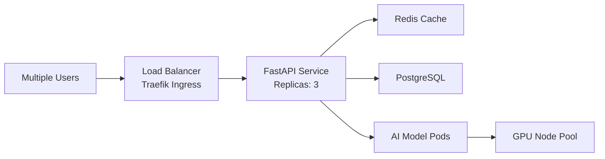

# Gorkheavy-Lite: Multi-Model AI Orchestration System

**A distributed AI ensemble system that combines five specialized language models to deliver optimized responses through intelligent parallel processing and judge-based selection.**

---

## What This Project Does

### The Problem
Single large language models are resource-intensive and often overkill for edge deployments. Running them requires expensive hardware and produces variable quality answers.

### The Solution
This project implements an **AI ensemble orchestration system** that:
- Combines **5 small, specialized models** (350M to 1.5B parameters)
- Processes queries through **3 models in parallel** for diverse perspectives
- Uses a **judge model to select the best answer** from multiple candidates
- Optimizes prompts automatically before processing
- Maintains conversation context for coherent multi-turn dialogues

### Key Innovation
**Async parallel processing** reduces response time from 15+ seconds (sequential) to the duration of the slowest model, while the judge ensures quality by evaluating correctness, completeness, and clarity across all responses.

### Results
- ✅ **Hardware-efficient**: Runs on edge devices with modest CPU resources
- ✅ **Flexible deployment**: Three options (K3s cluster, desktop, local Docker)
- ✅ **Fast deployment**: ~1.5 minutes from manifest to running system
- ✅ **Scalable**: Add nodes, replicas, or models as needed

---

## System Architecture



**Workflow Breakdown:**
1. **User submits query** to orchestrator
2. **Promptimizer** rewrites query for clarity and precision
3. **Three models process in parallel** (2-8 seconds depending on hardware)
4. **Judge evaluates** all responses using conversation context
5. **Best answer returned** to user

---

## Three Deployment Methods

This project offers **three deployment paths** to match different infrastructure and use cases:

### 1. **k3s/** - Production Multi-Node Cluster

**Use Case:** Edge deployment on bare-metal servers or Proxmox VMs
**Infrastructure:** 1 master + 2+ worker nodes
**Scalability:** Horizontal (add worker nodes for more capacity)

**Best For:**
- Production edge deployments
- Distributed workloads across multiple machines
- High availability requirements
- Teams familiar with Kubernetes

**Key Features:**
- Pod distribution across nodes (topology spread constraints)
- Automatic health checks and restarts
- Service discovery via Kubernetes DNS
- Resource limits and requests enforcement

---

### 2. **llama_swap/** - Hal Desktop Deployment

**Use Case:** Running on a powerful local AI desktop ("Hal")
**Infrastructure:** Single high-performance workstation
**Scalability:** Vertical (add more RAM/CPU/GPU to one machine)

**Best For:**
- Centralized AI workstation deployments
- Dynamic model swapping for different tasks
- Teams with dedicated AI hardware
- Scenarios requiring quick model changes

**Key Features:**
- Model hot-swapping without full redeployment
- Optimized for single-machine performance
- Direct hardware access (GPUs, high RAM)
- Simplified networking (localhost)

---

### 3. **local_docker/** - Development & Testing

**Use Case:** Local development on any machine with Docker
**Infrastructure:** Single laptop/desktop with Docker installed
**Scalability:** Limited to host machine resources

**Best For:**
- Development and testing before production deployment
- Quick proof-of-concept demonstrations
- Learning and experimentation
- CI/CD pipeline testing

**Key Features:**
- One-command deployment (`docker-compose up`)
- No cluster setup required
- Fast iteration cycles
- Portable across development environments

---

### Deployment Comparison

| Aspect | k3s | llama_swap | local_docker |
|--------|-----|------------|--------------|
| **Setup Time** | 2 hours (cluster) + 1.5 min (app) | 30 mins | 5 mins |
| **Hardware Required** | 3+ machines | 1 powerful machine | 1 laptop |
| **Complexity** | High | Medium | Low |
| **Scalability** | Horizontal | Vertical | Limited |
| **Production Ready** | Yes | Yes | No (dev only) |
| **High Availability** | Yes | No | No |
| **Cost** | Medium (3 machines) | High (1 powerful machine) | Low (existing dev machine) |

---

## Infrastructure Quick Start

### For K3s Deployment (Full Details in `/k3s/README.md`)

**Step 1: Install Proxmox Hypervisor**
1. Download Proxmox VE ISO from https://www.proxmox.com/en/downloads
2. Flash to USB drive (Rufus on Windows, `dd` on Linux)
3. Boot target hardware and follow installation wizard
4. Access web UI at `https://<proxmox-ip>:8006/`

**Step 2: Create Ubuntu VMs**
1. Upload Ubuntu Server ISO to Proxmox storage
2. Create 3 VMs: 1 master (4 vCPU, 8GB RAM) + 2 workers (4 vCPU, 8GB RAM each)
3. Configure static IPs (range: x.x.x.200+)
4. Enable SSH and set up key-based authentication
5. Configure passwordless sudo

**Step 3: Prepare Nodes for K3s**
```bash
# On all nodes:
sudo ufw disable              # Disable firewall
sudo swapoff -a               # Disable swap (required for Kubernetes)
sudo timedatectl set-ntp true # Enable time sync
```

**Step 4: Install K3s Cluster**
```bash
# On master node:
curl -sfL https://get.k3s.io | sh -
sudo cat /var/lib/rancher/k3s/server/node-token  # Copy this token

# On each worker node:
curl -sfL https://get.k3s.io | K3S_URL=https://<master-ip>:6443 \
  K3S_TOKEN=<node-token> sh -

# Verify cluster:
sudo k3s kubectl get nodes  # All nodes should show "Ready"
```

**Step 5: Deploy Application**
```bash
cd k3s/
sudo k3s kubectl apply -f script_final.yaml
sudo k3s kubectl get pods -w  # Watch deployment progress (~1.5 minutes)
```

**Step 6: Access Orchestrator**
```bash
sudo kubectl exec -it <orchestrator-pod-name> -- /bin/bash
# Inside pod, Python script starts automatically
```

---

## How to Scale the Concept

### 1. Horizontal Scaling (Add More Resources)

**Add Worker Nodes:**
```bash
# Install K3s agent on new machine
curl -sfL https://get.k3s.io | K3S_URL=https://<master-ip>:6443 \
  K3S_TOKEN=<node-token> sh -
```
Kubernetes automatically distributes new pods to added nodes.

**Increase Model Replicas:**
```bash
sudo k3s kubectl scale deployment/llama --replicas=3
sudo k3s kubectl scale deployment/qwen --replicas=3
```
Service load balancer automatically distributes requests across replicas.

---

### 2. Vertical Scaling (Bigger Machines)

**Upgrade Node Resources:**
- Increase VM CPU/RAM in Proxmox
- Kubernetes automatically uses additional resources
- Update resource limits in `script_final.yaml` to match new capacity

**Add GPU Acceleration:**
- Install NVIDIA GPU in worker nodes
- Deploy NVIDIA device plugin for Kubernetes
- Modify Dockerfiles to use CUDA-enabled Ollama
- Expected improvement: 2-3x faster inference

---

### 3. Model Scaling (Add or Swap Models)

**Add More Models to Ensemble:**
1. Create new Dockerfile with additional model (e.g., `Dockerfile.mistral`)
2. Add deployment and service to `script_final.yaml`
3. Update `final_script.py` to include new model in parallel processing
4. Rebuild and redeploy

**Use Larger Models:**
- Replace `llama3.2:1b` → `llama3.2:3b` in Dockerfile
- Increase memory limits in deployment manifest
- Better accuracy at cost of slower inference

---

### 4. Geographic Scaling (Multiple Locations)

**Deploy Multiple Clusters:**
- Set up K3s clusters in different regions (edge locations, data centers)
- Use DNS-based routing to direct users to nearest cluster
- Sync conversation history via shared database (PostgreSQL/Redis)

**Multi-Cluster Orchestration:**
- Implement cluster federation
- Load balance across clusters based on capacity
- Failover between clusters for high availability

---

### 5. Architectural Scaling (Add Features)

**Add API Frontend:**
- Replace CLI with FastAPI REST service
- Support multiple concurrent users
- WebSocket for streaming responses
- Authentication and rate limiting

**Add Persistent Storage:**
- PostgreSQL for conversation history
- Redis for response caching
- Persistent volumes for model storage

**Add Monitoring:**
- Prometheus for metrics collection
- Grafana for visualization dashboards
- Alert on pod failures or high response times

**Example Evolution:**


---

## Technical Specifications

### Models Used
| Model | Size | Purpose |
|-------|------|---------|
| Granite4 | 350M | Prompt optimization |
| LLaMA 3.2 | 1B | General reasoning and broad knowledge |
| Qwen 2.5 Coder | 1.5B | Code generation and technical queries |
| Qwen 3 | 600M | Fast responses with low latency |
| Gemma 3 | 1B | Answer evaluation and selection |

**Total Model Footprint:** ~4.5GB

### Resource Requirements

**Minimum (K3s):**
- 3 machines (1 master + 2 workers)
- 4 CPU cores per machine
- 8GB RAM per machine
- 32GB disk per machine

**Recommended (K3s):**
- 3 machines (1 master + 2 workers)
- 8 CPU cores per machine
- 16GB RAM per machine
- 64GB SSD per machine

**Desktop (llama_swap):**
- 1 powerful workstation
- 16+ CPU cores
- 32GB+ RAM
- 128GB SSD

**Local Development (local_docker):**
- Any laptop with Docker
- 4+ CPU cores
- 8GB+ RAM
- 20GB free disk space

### Performance

**Deployment Time:** ~1.5 minutes (K3s), ~2 minutes (Docker Compose)
**Response Time:** Hardware-dependent (CPU performance, RAM bandwidth, system load)
**Concurrency:** Single conversation per orchestrator pod (scale replicas for multiple users)

---

## Repository Organization

```
gorkheavy-lite/
├── k3s/              → Multi-node Kubernetes deployment
│                       Full production setup with Proxmox/VMs
│
├── llama_swap/       → Hal desktop model swapping deployment
│                       Optimized for single powerful machine
│
└── local_docker/     → Docker Compose for local development
                        Quick testing without cluster setup
```

**Each folder contains:**
- Deployment-specific manifests/configs
- Detailed README for that deployment method
- Any unique scripts or configurations

---

## Quick Links

### Deployment Guides
- **[K3s Cluster Deployment](./k3s/README.md)** - Full Proxmox → Ubuntu → K3s setup
- **[Hal Desktop Setup](./llama_swap/README.md)** - Model swapping on single machine
- **[Local Docker Development](./local_docker/README.md)** - Quick Docker Compose setup

### Docker Images
All images available on Docker Hub under `sebastein/*`:
- `sebastein/promptimizer:v5.0`
- `sebastein/llama:v5.0`
- `sebastein/qwen:v5.0`
- `sebastein/qwen_small:v5.0`
- `sebastein/judge:v5.0`
- `sebastein/final_script:v5.0`

### Architecture Decisions

**Why small models instead of one large model?**
- Edge-deployable on modest hardware
- Diverse reasoning from different model architectures
- Faster combined inference through parallelization
- Lower memory footprint (4.5GB vs 50GB+ for large models)

**Why judge-based selection?**
- Quality control - best answer selected from multiple candidates
- Adapts to query type (code vs general vs reasoning)
- Provides redundancy if one model fails
- Maintains consistency through conversation context

**Why Kubernetes/K3s?**
- Production-grade orchestration without heavyweight K8s overhead
- Automatic pod distribution and health management
- Easy horizontal scaling (add nodes/replicas)
- Industry-standard deployment model

---

## What I Built

This project demonstrates a **complete, production-ready AI orchestration system** from infrastructure to application:

### Infrastructure Layer
- Automated Proxmox hypervisor deployment
- Ubuntu VM provisioning with proper networking and security
- K3s cluster installation and configuration
- Resource optimization for Kubernetes workloads

### Containerization Layer
- 6 custom Docker images optimized for AI workloads
- Ollama-based model serving with automatic pulling
- Lightweight Python orchestrator container
- Proper signal handling and graceful shutdown

### Application Layer
- Async Python orchestration with `aiohttp` for concurrent requests
- Intelligent prompt optimization before processing
- Parallel model execution using `asyncio.gather()`
- Judge-based answer selection with conversation memory
- Error handling and retry logic

### Orchestration Layer
- Kubernetes manifests with resource limits and requests
- Topology spread constraints for pod distribution
- Node affinity rules to protect control plane
- Init containers for service readiness verification
- Liveness and readiness health probes

### Flexibility Layer
- **Three deployment options** for different scenarios
- **Scaling strategies** from vertical to geographic
- **Modular design** allowing model swapping and additions
- **Documented architecture** for team knowledge transfer

**Total Lines of Code:** ~1,200 (Python, YAML, Dockerfiles)
**Documentation:** Comprehensive guides for each deployment method
**Deployment Time:** From bare metal to running AI in ~2 hours (K3s) or ~5 minutes (Docker)

---

## License

This project is licensed under the MIT License. See `LICENSE` file for details.

---

**Built for edge AI orchestration - Production-ready, scalable, and flexible.**
